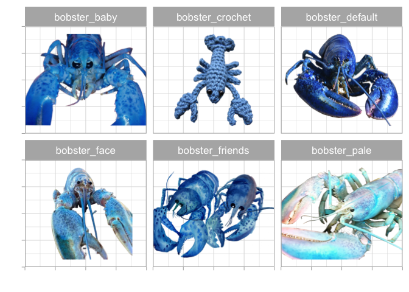
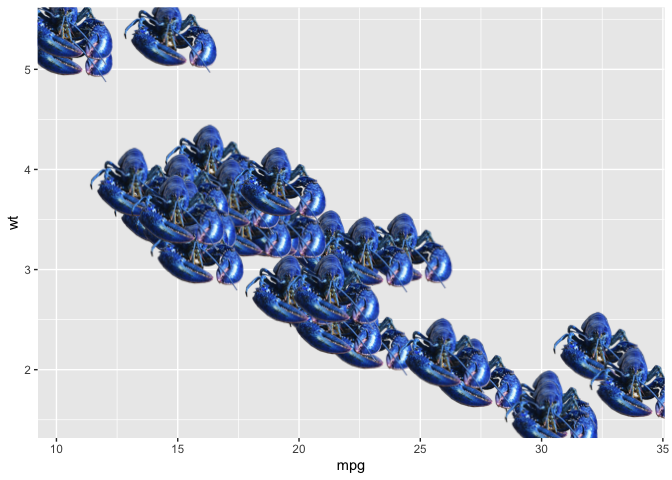
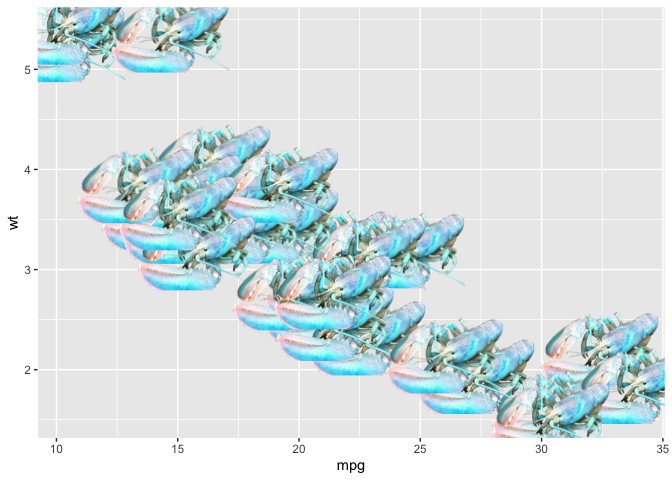

<!-- README.md is generated from README.Rmd. Please edit that file -->

# ggbobster

<!-- badges: start -->
<!-- badges: end -->

A ggplot2 geom for adding Blobster.

## Installation

You can install the development version of ggbobster from
[GitHub](https://github.com/) with:

``` r
# install.packages("devtools")
devtools::install_github("martinasladek/ggbobster")
```

## Available Bobsters

There are 6 Bobsters available:

``` r
bobsters <- c("bobster_default", 
              "bobster_pale", 
              "bobster_face", 
              "bobster_baby",
              "bobster_friends", 
              "bobster_crochet" 
              ) 

df <- data.frame(x = 1, y = 1, image = bobsters) 


library(ggplot2)
#> Warning: package 'ggplot2' was built under R version 4.2.3
library(ggbobster)

df |> 
  ggplot2::ggplot() +
  ggbobster::geom_bobster(aes(x = x, y = y, bobster = image), size = 2) +
  facet_wrap(~image)+
  theme_light(base_size = 16) + 
  labs(x = "", y = "") + 
  theme(
    axis.text = element_blank()
  )
```



## Classic Bobster

This is a basic example which shows you how to solve a common problem:

``` r
mtcars |> 
  ggplot2::ggplot(aes(mpg, wt)) +
  ggbobster::geom_bobster()
```



## Pale Bobster

``` r
mtcars |> 
  ggplot2::ggplot(aes(mpg, wt)) +
  ggbobster::geom_bobster(bobster = "bobster_pale")
```


